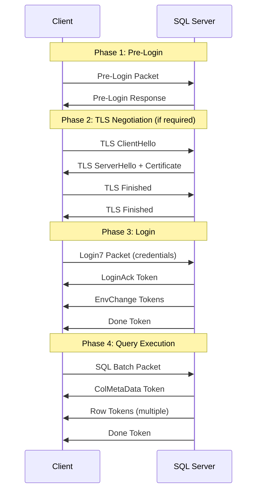

# SQL Server 驱动开发快速启动指南

## ✅ 已完成

### A. Docker SQL Server 测试环境

已创建以下文件：

- **docker-compose.mssql.yml** - SQL Server 2022 容器配置
- **docker/mssql/init.sql** - 数据库初始化脚本
- **docker-mssql.sh** - 管理脚本

**连接信息：**
```
Host: localhost
Port: 1433
User: sa
Password: ClassTop@2024Dev!
Database: classtop_dev
```

**管理命令：**
```bash
# 启动 SQL Server
./docker-mssql.sh start

# 停止 SQL Server
./docker-mssql.sh stop

# 查看日志
./docker-mssql.sh logs

# 进入 SQL Shell
./docker-mssql.sh shell

# 执行 SQL 查询
./docker-mssql.sh query "SELECT * FROM test_types"

# 显示状态
./docker-mssql.sh status

# 帮助信息
./docker-mssql.sh help
```

### B. mssql-driver 子项目骨架

已创建完整的项目结构：

```
mssql-driver/
├── Cargo.toml                    # 项目配置
├── README.md                      # 项目文档
├── src/
│   ├── lib.rs                    # 库入口
│   ├── error.rs                  # 错误类型 ✅
│   ├── connection/
│   │   ├── mod.rs                # 连接管理 🚧
│   │   ├── config.rs             # 配置系统 ✅
│   │   └── pool.rs               # 连接池 (占位)
│   ├── protocol/
│   │   ├── mod.rs                # 协议抽象 🚧
│   │   ├── packets.rs            # TDS 包结构 ✅
│   │   └── tokens.rs             # Token 定义 ✅
│   ├── types.rs                  # 类型系统 ✅
│   ├── transaction.rs            # 事务支持 (占位)
│   └── utils/
│       ├── mod.rs
│       └── encoding.rs           # 字符编码 ✅
├── examples/
│   ├── simple_connect.rs         # 连接示例
│   └── query_test.rs             # 查询示例
└── tests/                        # 集成测试目录
```

**✅ = 已实现基础框架**
**🚧 = 占位实现，待完善**

## 📖 开发流程

### 第一步：启动测试环境

```bash
# 1. 启动 Docker Desktop
open -a Docker

# 2. 等待 Docker 启动完成，然后启动 SQL Server
./docker-mssql.sh start

# 3. 验证数据库可用
./docker-mssql.sh query "SELECT DB_NAME() AS db, @@VERSION AS ver"
```

### 第二步：开发驱动

```bash
cd mssql-driver

# 编译检查
cargo check

# 运行测试
cargo test

# 运行示例 (当前会连接失败，因为协议层未实现)
cargo run --example simple_connect

# 开发时自动重新编译
cargo watch -x check
```

### 第三步：实现 TDS 协议

**当前待实现功能：**

1. **Pre-Login 包**
   - 文件：`src/protocol/packets.rs`
   - 目标：协商 TLS 和协议版本
   - 参考：[MS-TDS 2.2.6.4](https://docs.microsoft.com/en-us/openspecs/windows_protocols/ms-tds/60f56408-0188-4cd5-8b90-25c6f2423868)

2. **Login7 包**
   - 文件：`src/protocol/packets.rs`
   - 目标：发送认证信息
   - 参考：[MS-TDS 2.2.6.3](https://docs.microsoft.com/en-us/openspecs/windows_protocols/ms-tds/773a62b6-ee89-4c02-9e5e-344882630aac)

3. **SQL Batch 包**
   - 文件：`src/protocol/query.rs` (待创建)
   - 目标：执行 SQL 语句
   - 参考：[MS-TDS 2.2.6.6](https://docs.microsoft.com/en-us/openspecs/windows_protocols/ms-tds/619c43b6-9495-4a58-9e49-a4950db245b3)

4. **Token Stream 解析**
   - 文件：`src/protocol/result.rs` (待创建)
   - 目标：解析结果集
   - 参考：[MS-TDS 2.2.7](https://docs.microsoft.com/en-us/openspecs/windows_protocols/ms-tds/d2ed21d6-527b-46ac-8035-94f6f68eb9a8)

## 🧪 测试策略

### 单元测试

```bash
# 运行所有单元测试
cargo test

# 运行特定模块测试
cargo test connection::config::tests

# 显示测试输出
cargo test -- --nocapture

# 显示测试日志
RUST_LOG=debug cargo test -- --nocapture
```

### 集成测试

```bash
# 创建集成测试文件
touch mssql-driver/tests/integration_test.rs

# 运行集成测试 (需要 SQL Server 运行)
cargo test --test integration_test
```

### 手动测试

```bash
# 运行连接示例
RUST_LOG=debug cargo run --example simple_connect

# 运行查询示例
RUST_LOG=debug cargo run --example query_test
```

## 📚 学习资源

### 必读文档

1. **MS-TDS 协议规范** (500+ 页)
   - URL: https://docs.microsoft.com/en-us/openspecs/windows_protocols/ms-tds
   - 重点章节：
     - 2.2.6: Packet Data
     - 2.2.7: Token Data Stream
     - 3.1.5: Processing Events and Sequencing Rules

2. **Tiberius 源码** (参考实现)
   - URL: https://github.com/prisma/tiberius
   - 重点文件：
     - `src/tds/codec/mod.rs` - 编解码器
     - `src/tds/codec/login.rs` - 登录流程
     - `src/client/mod.rs` - 客户端实现

3. **Rust Async Book**
   - URL: https://rust-lang.github.io/async-book/
   - 重点章节：Streams, Futures, Tokio

### 协议交互时序图



## 🔧 开发工具

### 推荐 VS Code 扩展

- **rust-analyzer** - Rust 语言服务器
- **CodeLLDB** - 调试器
- **Even Better TOML** - Cargo.toml 语法高亮
- **Error Lens** - 内联错误显示

### 有用的 Cargo 命令

```bash
# 安装 cargo-watch (自动重新编译)
cargo install cargo-watch

# 安装 cargo-expand (宏展开)
cargo install cargo-expand

# 安装 cargo-tree (依赖树)
cargo install cargo-tree

# 格式化代码
cargo fmt

# 代码检查
cargo clippy -- -D warnings

# 生成文档
cargo doc --open
```

## 📝 下一步行动

现在你可以开始实现 TDS 协议了！建议按以下顺序：

1. ✅ **完成环境搭建** (已完成)
2. 📖 **阅读 MS-TDS 协议文档** (1-2周)
   - 专注于 Pre-Login 和 Login7 部分
   - 绘制数据结构图
3. 🔨 **实现 Pre-Login** (1周)
   - 构造 Pre-Login 包
   - 发送并接收响应
   - 解析服务器能力
4. 🔐 **实现 Login7** (1-2周)
   - 构造认证包
   - 处理 LoginAck 和 EnvChange tokens
   - 测试成功连接
5. 🔍 **实现查询执行** (2-3周)
   - SQL Batch 包构造
   - Token Stream 解析
   - 结果集提取

## 🆘 常见问题

### Q: 编译错误怎么办？

```bash
# 清理并重新编译
cargo clean
cargo build
```

### Q: SQL Server 无法连接？

```bash
# 检查 Docker 状态
docker ps

# 检查容器日志
./docker-mssql.sh logs

# 重启容器
./docker-mssql.sh restart
```

### Q: 如何调试 TDS 协议包？

```bash
# 使用 Wireshark 抓包
# 过滤器：tcp.port == 1433

# 或者在代码中打印二进制数据
println!("{:02X?}", packet_bytes);
```

### Q: 测试数据在哪里？

```bash
# 查看测试数据
./docker-mssql.sh query "SELECT * FROM test_types"

# 重新初始化数据库
./docker-mssql.sh reinit
```

---

## 🎉 总结

✅ **已完成任务 A 和 B：**

- [x] Docker SQL Server 测试环境搭建完成
- [x] mssql-driver 子项目骨架创建完成
- [x] 项目可以正常编译
- [x] 示例代码和测试框架就绪

**现在可以开始正式的 TDS 协议实现了！**

**估算时间线：**
- 阶段 1 (协议研究): 1-2 周
- 阶段 2 (基础连接): 2-3 周
- 阶段 3 (查询执行): 3-4 周
- 阶段 4 (参数化查询): 2-3 周
- 阶段 5 (连接池+事务): 2-3 周
- 阶段 6 (集成 Classtop): 2 周

**总计: 3-6 个月**

祝开发顺利！🚀
